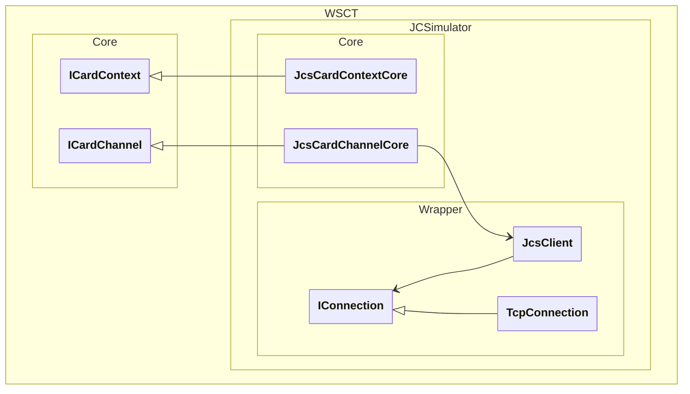

# WSCT.JCSimulator

Public repository for WSCT GlobalPlatform project.

## Goal

Enable the WSCT framework to communicate directly with a Java Card simulator.

## Features

This project is currently a *work in progress*.

- **Java Card Simulator**:
  - [x] Connect to the Java Card simulator using localhost and default port 9025
  - [x] Connect to a simulator using any other protocol than TCP/IP

- **Card management**:
  - [x] Connect to the card
  - [ ] Support PPS
  - [x] Retrieve ATR
  - [x] Disconnect from the card

- **T=0 transmission protocol**: not yet implemented

- **T=1 transmission protocol**:
  - [x] Negociate IFSC / IFSD
  - [x] Receive chained I-block
  - [x] Send chained I-block
  - [ ] Handle transmission errors

- **APDU**:
  - [x] Send APDU command
  - [x] Receive APDU response

- **Implementation for WSCT**:
  - [x] ICardContext interface
  - [x] ICardChannel interface
  - [ ] ICardContextLayer interface
  - [ ] ICardChannelLayer interface

## Architecture overview



## Usage examples

### Using the WSCT wrapper (LinqPad script)

```csharp
var context = new JcsCardContextCore().ToObservable();
context.Establish().Dump("Establish");

context.ListReaders("").Dump("listReaders");
context.Readers.Dump();

var jcSimulatorClient = new Client(new TcpConnection("127.0.0.1", 9025));
await jcSimulatorClient.ConnectToSimulatorAsync();

var channel = new JcsCardChannelCore(context, context.Readers.Last(), jcSimulatorClient);
channel.Connect(ShareMode.Exclusive, Protocol.Any)
	.Dump("Connect");

byte[] atr = [];
channel.GetAttrib(Attrib.AtrString, ref atr);
atr.DumpHexa("ATR");

var capdu = new CommandAPDU("00 A4 04 00 00")
	.Dump("C-APDU SELECT", collapseTo: 0);

var crp = new CommandResponsePair(capdu);
crp.Transmit(channel)
	.Dump("transmit");
crp.RApdu.Dump("rapdu");

channel.Disconnect(Disposition.UnpowerCard)
	.Dump("Disconnect");

context.Release()
	.Dump("release");
```

  ### Using the raw wrapper (LinqPad script)

```csharp
var jcSimulatorClient = new Client(new TcpConnection("127.0.0.1", 9025));

await jcSimulatorClient.ConnectToSimulatorAsync();

// **** Connect()

await jcSimulatorClient.SendAsync("F0 00 00 00".FromHexa().DumpHexa("D ▶ C Connect"));

var connectResult = await jcSimulatorClient.ReceiveDeviceResultAsync()
	.DumpHexa("D ◀ C Connect Result");
var atr = connectResult[4..].DumpHexa("ATR");

// **** IFS

await jcSimulatorClient.SendIfsAsync(0xfe);

// **** SELECT Command

var apdu = new CommandAPDU("00 A4 04 00 00")
	//var apdu = new CommandAPDU("00 A4 04 00 07 F0010203040001")
	.Dump("C-APDU SELECT", collapseTo: 0);

await jcSimulatorClient.SendCommandAPDUAsync(apdu);

var responseApdu = await jcSimulatorClient.ReceiveResponseApduAsync()
	.Dump("R-APDU");

// **** Disconnect()

await jcSimulatorClient.SendAsync("FE 00 00 00".FromHexa().DumpHexa("D ▶ C Connect"));

var disconnectResult = await jcSimulatorClient.ReceiveDeviceResultAsync()
	.DumpHexa("D ◀ C Disconnect Result");

jcSimulatorClient.DisconnectFromSimulator();
```

